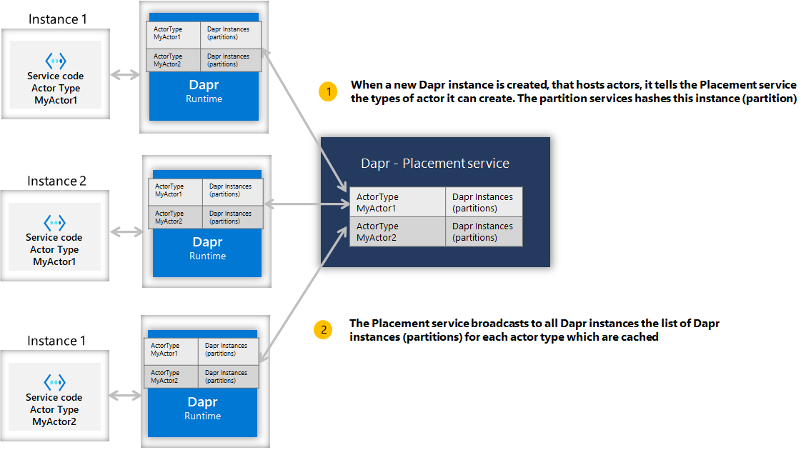
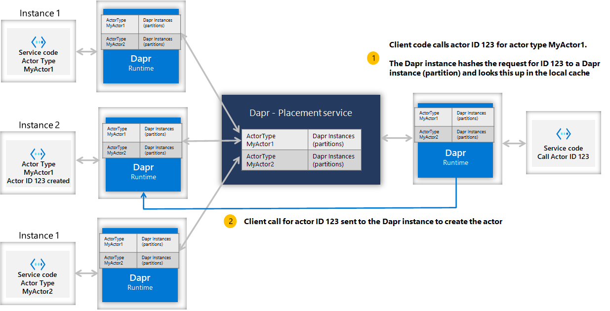
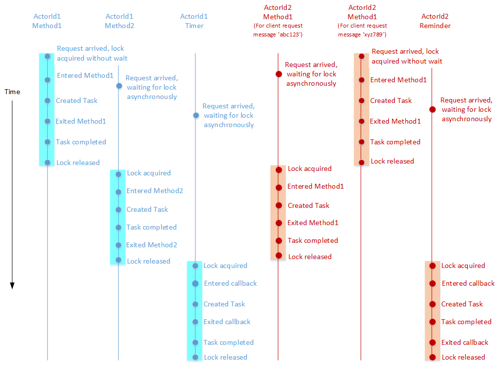

# Introduction to Actors

Dapr runtime provides an actor implementation which is based on Virtual Actor pattern. The Dapr actors API provides a single-threaded programming model leveraging the scalability and reliability guarantees provided by underlying platform on which Dapr is running.

## Quick Links

- [Dapr Actor Features](./actors_features.md)
- [Dapr Actor API Spec](./actors_api.md)

## Contents

- [Understanding Actors](#understanding-actors)
- [Actors in Dapr](#actors-in-dapr)
- [Actor Lifetime](#actor-lifetime)
- [Distribution and Failover](#distribution-and-failover)
- [Actor Communication](#actor-communication)

## Understanding Actors

An actor is an isolated, independent unit of compute and state with single-threaded execution.

The [actor pattern](https://en.wikipedia.org/wiki/Actor_model) is a computational model for concurrent or distributed systems in which a large number of these actors can execute simultaneously and independently of each other. Actors can communicate with each other and they can create more actors.

### When to use Actors

Dapr actors is an implementation of the actor design pattern. As with any software design pattern, the decision whether to use a specific pattern is made based on whether or not a software design problem fits the pattern.

Although the actor design pattern can be a good fit to a number of distributed systems problems and scenarios, careful consideration of the constraints of the pattern and the framework implementing it must be made. As general guidance, consider the actor pattern to model your problem or scenario if:

* Your problem space involves a large number (thousands or more) of small, independent, and isolated units of state and logic.
* You want to work with single-threaded objects that do not require significant interaction from external components, including querying state across a set of actors.
* Your actor instances won't block callers with unpredictable delays by issuing I/O operations.

## Actors in Dapr

Every actor is defined as an instance of an actor type, identical to the way an object is an instance of a class. For example, there may be an actor type that implements the functionality of a calculator and there could be many actors of that type that are distributed on various nodes across a cluster. Each such actor is uniquely identified by an actor ID.


## Actor Lifetime

Dapr actors are virtual, meaning that their lifetime is not tied to their in-memory representation. As a result, they do not need to be explicitly created or destroyed. The Dapr actors runtime automatically activates an actor the first time it receives a request for that actor ID. If an actor is not used for a period of time, the Dapr Actors runtime garbage-collects the in-memory object. It will also maintain knowledge of the actor's existence should it need to be reactivated later.

Invocation of actor methods and reminders reset the idle time, e.g. reminder firing will keep the actor active. Actor reminders fire whether an actor is active or inactive, if fired for inactive actor, it will activate the actor first. Actor timers do not reset the idle time, so timer firing will not keep the actor active. Timers only fire while the actor is active.

The idle timeout and scan interval Dapr runtime uses to see if an actor can be garbage-collected is configurable. This information can be passed when Dapr runtime calls into the actor service to get supported actor types.

This virtual actor lifetime abstraction carries some caveats as a result of the virtual actor model, and in fact the Dapr Actors implementation deviates at times from this model.

An actor is automatically activated (causing an actor object to be constructed) the first time a message is sent to its actor ID. After some period of time, the actor object is garbage collected. In the future, using the actor ID again, causes a new actor object to be constructed. An actor's state outlives the object's lifetime as state is stored in configured state provider for Dapr runtime.

## Distribution and Failover

To provide scalability and reliability, actors instances are distributed throughout the cluster and Dapr  automatically migrates them from failed nodes to healthy ones as required.

Actors are distributed across the instances of the actor service, and those instance are distributed across the nodes in a cluster. Each service instance contains a set of actors for a given actor type.

The Dapr actor runtime manages distribution scheme and key range settings for you. This is done by the actor Placement service. When a new instance of a service is created, the corresponding Dapr runtime register the actor types it can create and the Placement service calculates the partitioning across all the instances for a given actor type. This table of partition information for each actor type is updated and stored in each Dapr instance running in the environment and can change dynamically as new instance of actor services are created and destroyed. This is shown in the diagram below.



When a client calls an actor with a particular id (for example, actor id 123), the Dapr instance for the client hashes the actor type and id, and uses the information to call onto the corresponding Dapr instance that can serve the requests for that particular actor id. As a result, the same partition (or service instance) is always called for any given actor id. This is shown in the diagram below.



 This simplifies some choices but also carries some consideration:

* By default, actors are randomly placed into pods resulting in uniform distribution.
* Because actors are randomly placed, it should be expected that actor operations will always require network communication, including serialization and deserialization of method call data, incurring latency and overhead.

Note: The Dapr actor Placement service is only used for actor placement and therefore is not needed if your services are not using Dapr actors. The Placement service can run in all environments (Standalone, Kubernetes etc)

## Actor Communication

You can interact with Dapr to invoke the actor method by calling Http/gRPC endpoint

```bash
POST/GET/PUT/DELETE http://localhost:3500/v1.0/actors/<actorType>/<actorId>/<method/state/timers/reminders>
```

You can provide any data for actor method in the request body and response for the request would be in response body which is data from actor call.

Refer to [Dapr Actor Features](./actors_features.md) for more details.

### Concurrency

The Dapr Actors runtime provides a simple turn-based access model for accessing actor methods. This means that no more than one thread can be active inside an actor object's code at any time. Turn-based access greatly simplifies concurrent systems as there is no need for synchronization mechanisms for data access. It also means systems must be designed with special considerations for the single-threaded access nature of each actor instance.

A single actor instance cannot process more than one request at a time. An actor instance can cause a throughput bottleneck if it is expected to handle concurrent requests.

Actors can deadlock on each other if there is a circular request between two actors while an external request is made to one of the actors simultaneously. The Dapr actor runtime will automatically time out on actor calls and throw an exception to the caller to interrupt possible deadlock situations.


### Turn-based access

A turn consists of the complete execution of an actor method in response to a request from other actors or clients, or the complete execution of a timer/reminder callback. Even though these methods and callbacks are asynchronous, the Dapr Actors runtime does not interleave them. A turn must be fully finished before a new turn is allowed. In other words, an actor method or timer/reminder callback that is currently executing must be fully finished before a new call to a method or callback is allowed. A method or callback is considered to have finished if the execution has returned from the method or callback and the task returned by the method or callback has finished. It is worth emphasizing that turn-based concurrency is respected even across different methods, timers, and callbacks.

The Dapr actors runtime enforces turn-based concurrency by acquiring a per-actor lock at the beginning of a turn and releasing the lock at the end of the turn. Thus, turn-based concurrency is enforced on a per-actor basis and not across actors. Actor methods and timer/reminder callbacks can execute simultaneously on behalf of different actors.

The following example illustrates the above concepts. Consider an actor type that implements two asynchronous methods (say, Method1 and Method2), a timer, and a reminder. The diagram below shows an example of a timeline for the execution of these methods and callbacks on behalf of two actors (ActorId1 and ActorId2) that belong to this actor type.


